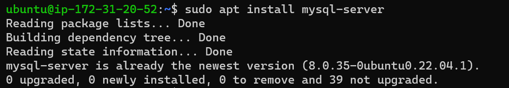
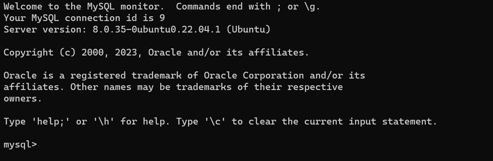
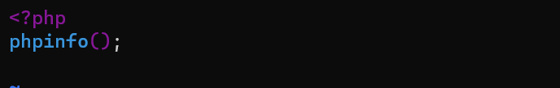

# Documentation of Project 1

## Installing Apache and Updating the Firewall
### Update a list of packages in package manager
`sudo apt update`

### Run apache2 package installation
`sudo apt install apache2`

### To verify Apache2 running status
`sudo systemctl status apcahe2`

### Accessing webserver from Ubuntu shell
`curl http://localhost:80`

### Accessing webserver over the internet
`http://54.87.226.229:80`

[Apache2 Ubuntu Default Page](http://http://16.16.68.188/)

## Installing mysql

### Running mysql installation
`sudo apt install mysql-server`

### Logging on to mysql console

`sudo mysql`

### Running pre-installed mysql security script

`ALTER USER 'root'@'localhost' IDENTIFIED WITH mysql_native_password BY 'xxxxxx';`

### Validate Passwword Plugin

`sudo mysql_secure_installation`

### Confirming logon to mysql console

`sudo mysql -p`

## Installing PHP

### Installing the php package, php-mysql and libapache2-mod-php

`sudo apt install php libapache2-mod-php php-mysql`

### Confirming PHP version

`php -v`

## Creating Virtual Host for Website Using Apache

### Setting up a doamin called projectlamp

### creating directory for projectlamp

`sudo mkdir /var/www/projectlamp`

### Assigning ownership of the directory to current system user

`sudo chown -R $USER:$USER /var/www/projectlamp`

### Creating and opening a new configuration file in Apache’s sites-available directory using vi

`sudo vi /etc/apache2/sites-available/projectlamp.conf`

### The following bare-bones configuration was used

### Using ls command to show new file in the sites-available directory

`sudo ls /etc/apache2/sites-available`

### Enabling new virtual host

`sudo a2ensite projectlamp`

### Disabling Apache default website

`sudo a2dissite 000-default`

### To confirm configuration file doesn’t contain syntax errors

`sudo apache2ctl configtest`

### reloading Apache to effect changes

`sudo systemctl reload apache2`

### Creating an index.html file in web root /var/www/projectlamp

`sudo echo 'Hello LAMP from hostname' $(curl -s http://169.254.169.254/latest/meta-data/public-hostname) 'with public IP' $(curl -s http://169.254.169.254/latest/meta-data/public-ipv4) > /var/www/projectlamp/index.html`

### Opening website from browser with public IP Address

[website with public IP](http://54.87.226.229:80)

## Enabling PHP on website
### Making index.php have precedence over index.html

`sudo vim /etc/apache2/mods-enabled/dir.conf`

### the following config was saved

### Reloading Apapche to effect changes

`sudo systemctl reload apache2`

### Creating file named index.php inside custom web root folder

`vim /var/www/projectlamp/index.php`

### PHP code saved for file configuration

### Refreshing the webpage on internet browser provides php server info

### Deleting index.php due to sensitive info displayed

`sudo rm /var/www/projectlamp/index.php`

# PHP installation is complete, web service is operational

# Project One Complete: Deployment of LAMP stack website in AWS Cloud!
